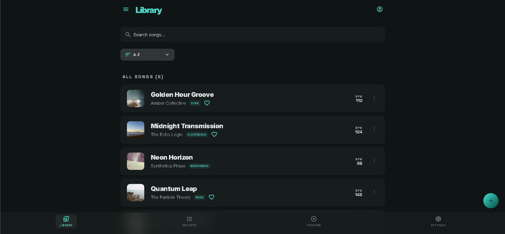

# 🎵 Lyra Chords v2.4.0

> **O melhor parceiro do instrumentista | The ultimate partner for live musicians.**

Lyra Chords é um ecossistema completo, elegante e de alto desempenho projetado sob medida para músicos, maestros e instrumentistas. Ele permite a organização inteligente de repertórios, visualização avançada de partituras em PDF, transposição dinâmica de tonalidades em tempo real, metrônomo interativo e integração avançada com guias de áudio pelo YouTube.



---

## 🇧🇷 Apresentação em Português

O Lyra Chords elimina as pastas físicas de música de papel e simplifica sua rotina, seja no palco em shows ao vivo (Live Performance), nos ensaios com sua banda ou em seus estudos diários.

### ✨ Recursos Principais
- **📂 Gestão Avançada de Biblioteca**: Controle total e categorização para cadastrar músicas, artistas, tons originais e visualizar estatísticas da sua jornada.
- **🔄 Transposição Dinâmica de Tons**: Altere a tonalidade das suas cifras instantaneamente de meio em meio tom com reformatação inteligente sem quebrar o layout.
- **📜 Rolo Direcional & Rolagem Automática (Autoscroll)**: Toque sem tirar as mãos do instrumento. Configure velocidades de rolagem dinâmica adaptáveis para cada canção.
- **🎼 Visualizador Gráfico de Partituras (Sheet Music PDF)**: Suporte completo para carregar seus arquivos PDF originais. Leia tablaturas e pautas musicais direto no Palco com zoom fluido e navegação silenciosa.
- **🧠 Importações Inteligentes**:
  - **Via Link**: Extraia automaticamente as letras e acordes de portais de cifras populares (e.g., Cifra Club) colando apenas a URL.
  - **Via PDF com IA**: Suba arquivos PDF comuns e nossa integração com Inteligência Artificial Gemini estruturará e posicionará os acordes do documento para você.
- **📺 Guia Sonoro & Vídeo Aulas (YouTube Backstage & Picture-in-Picture)**: Vincule vídeos de tutoriais ou faixas de backing track do YouTube. Assista em uma mini janela flutuante no canto da tela enquanto acompanha a cifra, ou use como áudio de fundo no reprodutor embutido do rodapé.
- **🥁 Metrônomo Acústico Integrado**: Mantenha o tempo exato com cliques de áudio nítidos, assinatura de compasso ajustável e sinalização visual de batidas.
- **🔌 Banco de Dados 100% Local (Offline-First)**: Todas as suas músicas e repertórios são salvos diretamente no navegador. Segurança absoluta contra quedas de internet no palco.

---

## 🇺🇸 English Presentation

Lyra Chords is a robust, lightweight, and modern performance console tailored for professional musicians to easily transition from messy paper folders to a digital cloud-assisted offline clipboard.

### ✨ Core Features
- **📂 Premium Repertoire Manager**: Easily organize and search tracks, original keys, performance logs, and check detailed library statistics.
- **🔄 Dynamic Transposition**: Instantly transpose chords up and down micro steps with clean real-time layouts.
- **📜 Smart Autoscroll**: Play uninterrupted. Start hands-free automatic screen sliding customized with individual speeds per track.
- **🎼 PDF Sheet Music Engine**: Store and visualize physical piano, voice, or drum sheets. Access fluid layout zooming and page scrolling directly on stage.
- **🧠 Automated Imports**:
  - **Via Link**: Input URLs from popular web chords directories to automatically isolate and parse lyrics and chords brackets.
  - **Via Text PDF Scanning**: Upload plain documents and let Gemini AI segment text blocks and align chords automatically.
- **📺 Multimedia Guides (YouTube Integrations)**: Bind study tracks or tutorial guides. Watch overlays in Picture-in-Picture or play background references via the bottom player.
- **🥁 Built-in Audio Metronome**: Keep perfect timing with high-fidelity click counts, customizable measures, and visual indicators.
- **🔌 Offline-First Architecture**: Powered by highly responsive browser storage. Play securely on stage without relying on server down-times or poor internet connections.

---

## 🛠️ Stack Tecnológica | Tech Stack

- **Frontend**: React 18, Vite, TypeScript
- **Styling**: Tailwind CSS, Framer Motion (for high-fidelity fluid transitions)
- **Engine de IA**: Google Gemini Developer SDK (`@google/genai`)
- **Backend / Proxy**: Node.js, Express (para OAuth do Spotify e proxies seguros de API)
- **Database**: IndexedDB / LocalStorage para persistência robusta local

---

## 🚀 Como Executar Localmente | Getting Started

### Pré-requisitos
Certifique-se de ter o **Node.js** instalado em sua máquina.

### Instalação

1. Clone o repositório ou baixe os arquivos da aplicação.
2. Instale as dependências executando:
   ```bash
   npm install
   ```

3. Crie e configure o arquivo `.env` com base no arquivo `.env.example`:
   ```bash
   cp .env.example .env
   ```
   *Nota: Opcionalmente insira as credenciais do Gemini API e Spotify API para habilitar as importações via IA e o tocador integrado do Spotify.*

### Executando em Desenvolvimento

Inicie o servidor local de desenvolvimento:
```bash
npm run dev
```
Acesse a aplicação pelo navegador em: `http://localhost:3000`

### Build para Produção

Gere arquivos prontos para compressão e deploy:
```bash
npm run build
```

---

## 🌟 Visual Moderno (Cosmic Slate Dark Theme)
A interface foi projetada utilizando regras de alto contraste cromático com paletas de cinza ardósia profunda e acentuações vibrantes de cor. Esta escolha técnica garante excelente legibilidade em palcos escuros ou ensaios com pouca luz ambiente, prevenindo fadiga ocular do músico.
